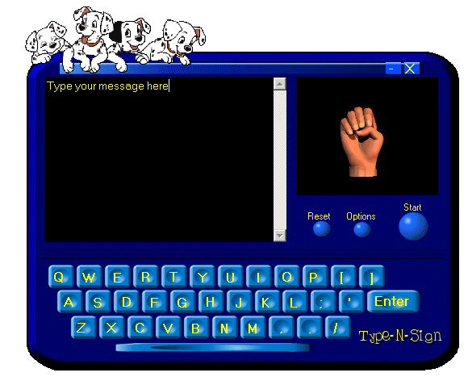



## Type\-N\-Sign \(A virtual interface for learning Sign Language\)

### Description

This is a BETA version 0.2. I have uploaded the latest copy.

It sports a virtual point and click keyboard. By ether hitting a key or typing directly into the console, Type-n-sign will then show the appropriate hand sign. Has play back, continuous play, and Speed control features. Even supports the ability to switch out hand modules (Have a Web or Digital Cam? Customize/personalize Type-N-sign to your needs...) Current module was created using poser.

[I take no responsibility for friends helping friends cheat on spelling test using this knowledge....]

Technical Notes::

 

Type-n-sign uses a transparent form based on the background picture (Pure API). The latest version loads its' data from a file (Program loads in under a second now. Thanks Doug) and if the data file isn't found it will create a new one. Since it is a transparent form, I relied on Popup menus and a graphical interface based on the picture itself. Also moved code from module to a class. Reads and writes to ini file as needed. (Checks to see if program is running for the first time, if so, sets a default file and brings up Options window.)

Please read the README.txt for further information
 
### More Info
 

             |
---                |---
**Submitted On**   |2001-04-06 11:35:12
**By**             |[No0ne](https://github.com/Planet-Source-Code/PSCIndex/blob/master/ByAuthor/no0ne.md)
**Level**          |Advanced
**User Rating**    |4.6 (134 globes from 29 users)
**Compatibility**  |VB 6\.0
**Category**       |[Complete Applications](https://github.com/Planet-Source-Code/PSCIndex/blob/master/ByCategory/complete-applications__1-27.md)
**World**          |[Visual Basic](https://github.com/Planet-Source-Code/PSCIndex/blob/master/ByWorld/visual-basic.md)
**Archive File**   |[Type\-N\-Sig18014462001\.zip](https://github.com/Planet-Source-Code/no0ne-type-n-sign-a-virtual-interface-for-learning-sign-language__1-21921/archive/master.zip)

